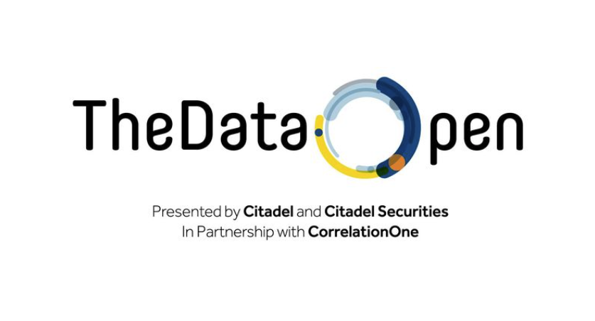

<a name="readme-top"></a>


<!-- PROJECT LOGO -->
<br />
<div align="center">
  <a href="https://github.com/Shivamkak19/Citadel-Datathon">
    
  </a>

<h3 align="center">Citadel Summer Invitational Datathon Team 10 Submission Repository</h3>

</div>

<!-- TABLE OF CONTENTS -->
<details align = "center">
  <summary>Table of Contents</summary>
  <ol align= "center">
    <li>
      <ul>
        <li><a href="#about-the-project">About the Project</a></li>
        <li><a href="#built-with">Built With</a></li>
      </ul>
    </li>
    <li>
      <a href="#getting-started">Getting Started</a>
      <ul>
        <li><a href="#prerequisites">Prerequisites</a></li>
        <li><a href="#installation">Installation</a></li>
      </ul>
    </li>
    <li><a href="#output">Output</a></li>
    <li><a href="#roadmap">Roadmap</a></li>
    <li><a href="#contact">Contact</a></li>
    <li><a href="#acknowledgments">Acknowledgments</a></li>
  </ol>
</details>

<!-- ABOUT THE PROJECT -->
## About The Project

![dataAnalysis-Image][product-screenshot]

# 1.1 Research Question
In flights of equivalent distances, does the cost of airfare correlate to the probability
of delays due to human error (factors other than weather)? A possible
correlation may serve to raise ethical questions in the airline industry over why
more expensive flights, which serve to drive more profits for airlines, are delayed
less frequently. Building off of this question, this paper investigates how certain
airlines may offer more valuable tickets per mile price. In addition, can a predictive
model be generated to determine delay times due to human error, given
an input of distance travelled, airline, and ticket price?

# 1.2 Hypothesis
Less expensive airfare tickets are likely to experience heightened delays due
to human error, which includes air system delays, security delays, and airport
delays. This correlation suggests that airlines may have a vested interest in
prioritizing more expensive flights when it comes to resource allocation and
minimizing delay times for customers deemed more valuable. This paper serves
to analyze this pressing societal issue via the foreground of thorough data analysis.

<p align="right">(<a href="#readme-top">back to top</a>)</p>


### Built With

* [![Pandas][pandas]][pandas-url]
* [![Numpy][numpy]][numpy-url]
* [![plotly][plotly]][plotly-url]
* [![xgboost][xgboost]][xgboost-url]
* [![scipy][scipy]][scipy-url]
* [![sklearn][sklearn]][sklearn-url]

<p align="right">(<a href="#readme-top">back to top</a>)</p>

<!-- GETTING STARTED -->
## Getting Started

All of the necessary dependencies are downloaded in the virtual environment set up in the final_version folder. Rather than downloading with a requirements.txt list, simply clone the repo and move into the final_version folder.

### Prerequisites

Datasets for the datathon are available here: https://drive.google.com/drive/folders/1ymin8YWtAlQFsnllQhuhdzif2aCS8rcZ.
Please make sure to adjust the relative paths to where you have saved the datasets in the "Importing Data" of data_preprocessing.ipynb.

### Installation

1. Clone the repo
   ```sh
   git clone https://github.com/Shivamkak19/Citadel-Datathon.git
   ```

2. Move into final_version folder  
   ```sh
   cd final_version
   ```

<p align="right">(<a href="#readme-top">back to top</a>)</p>

<!-- OUTPUT EXAMPLES -->
## Output

Below are a few images of our cleaned datasets and generated figures. Please refer to our final report and .ipynb files in the final_version directory for more thorough information.

![dataAnalysis-Image][product1]
![dataAnalysis-Image][product2]
![dataAnalysis-Image][product3]
![dataAnalysis-Image][product4]

<p align="right">(<a href="#readme-top">back to top</a>)</p>


<!-- ROADMAP -->
## Roadmap

- [ ] Exploratory Data Analysis on given datsets
- [ ] Determine research question and analysis strategy
- [ ] Data Preprocessing
    - [ ] Determine average fare per route
    - [ ] Create matching scheme between traffic route data points and average fares
    - [ ] Perform comprehensive testing to ensure correctness of matches
    - [ ] Determine average delay due to human error
- [ ] Data Visualization & Analysis
    - [ ] Analyze correlations between fare price per mile for each airline
    - [ ] Analyze correlations between average delay and average fare
    - [ ] Generate visuals and assign buckets based on route distance (i.e., 100 miles, 200 miles, etc)
- [ ] Design Predictive XGBoost Model
    - [ ] Assign average fare, distance, and airline_id_hotkey as input var
    - [ ] Predict average delay as output var
    - [ ] Split processed_traffic.csv into ramdonly assigned validation/training sets
    - [ ] Utilize model to predict average delay based on user input

See the [open issues](https://github.com/Shivamkak19/Citadel-Datathon/issues) for a full list of known issues and proposed features.

<p align="right">(<a href="#readme-top">back to top</a>)</p>


<!-- CONTACT -->
## Contact

Shivam Kak
  - [ ] Email: sk3686@princeton.edu 
  - [ ] [LinkedIn](https://www.linkedin.com/in/shivamkak/)

Michael Perry
  - [ ] Email: mperry2@andrew.cmu.edu
  - [ ] [LinkedIn](https://www.linkedin.com/in/michael-perry-325255180/)

Edward Zhang 
  - [ ] Email: edward.zhang@duke.edu
  - [ ] [LinkedIn](https://www.linkedin.com/in/ez246/)

Pieter Heesters 
  - [ ] Email: pheester@nd.edu
  - [ ] [LinkedIn](https://www.linkedin.com/in/pieter-heesters/)


Project Link: [https://github.com/Shivamkak19/Citadel-Datathon](https://github.com/Shivamkak19/Citadel-Datathon)

<p align="right">(<a href="#readme-top">back to top</a>)</p>

<!-- ACKNOWLEDGMENTS -->
## Acknowledgments

* []() Huge thanks to Correlation One and Citadel for hosting the event, providing resources and datasets, and offering support!

<p align="right">(<a href="#readme-top">back to top</a>)</p>

<!-- Links -->
[product-screenshot]: images/product1.png
[product1]: images/processedData.png
[product2]: images/AvgTicketPricePerMile.png
[product3]: images/DelayVsFare.png
[product4]: images/output.png

[pandas]: https://img.shields.io/badge/Pandas-e30487?style=for-the-badge&logo=pandas&logoColor=130654
[pandas-url]: https://pandas.pydata.org/

[numpy]: https://img.shields.io/badge/numpy-4dabcf?style=for-the-badge&logo=numpy&logoColor=white
[numpy-url]: https://numpy.org/

[plotly]: https://img.shields.io/badge/Plotly.Express-4787f5?style=for-the-badge&logo=plotly&logoColor=black
[plotly-url]: https://plotly.com/python/plotly-express/

[xgboost]: https://img.shields.io/badge/XGBOOST-22a038?style=for-the-badge
[xgboost-url]: https://xgboost.readthedocs.io/en/stable/

[scipy]: https://img.shields.io/badge/SciPy-023243?style=for-the-badge&logo=scipy&logoColor=0054a6
[scipy-url]: https://scipy.org/

[sklearn]: https://img.shields.io/badge/sklearn-ff9c34?style=for-the-badge&logo=scikitlearn&logoColor=3599cd
[sklearn-url]: https://scikit-learn.org/stable/


